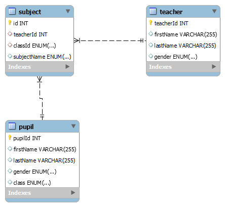

# სატესტო დავალებები


1.	დაწერეთ ფუნქცია, რომელსაც გადაეცემა string-ი და აბრუნებს True-ს თუ  გადაცემული string-ი პალინდრომია, წინააღმდეგ შემთხვევაში False-ს. პალინდრომი არის ტექსტი რომელიც ერთნაირად იკითხება ორივე მხრიდან, მაგ: radar, level, rotor, abcdcba.


```python
def isPalindrom(text):
    if text==text[::-1]:
        return True
    return False
# Check:
print(isPalindrom("radar"))
print(isPalindrom("abcdcba"))
print(isPalindrom("notpalindrom"))


    
```

    True
    True
    False
    

2.	გვაქვს 1,5,10,20 და 50 თეთრიანი მონეტები. დაწერეთ ფუნქცია, რომელსაც გადაეცემა თანხა (თეთრებში) და აბრუნებს მონეტების მინიმალურ რაოდენობას, რომლითაც შეგვიძლია ეს თანხა დავახურდაოთ.


```python
import math
def change(amount):
    count=0
    for coin in [50,20,10,5,1]:
        nCoin = math.floor(amount/coin)
        count+=nCoin
        amount-=coin*nCoin
        if amount==0:
            break
    return count


#Check

print(change(58))
print(change(96))
print(change(3))
    
```

    5
    5
    3
    

3.	მოცემულია string-ი რომელიც შედგება “(“ და “)“ ელემენტებისგან. დაწერეთ ფუნქცია რომელიც აბრუნებს ფრჩხილები არის თუ არა მათემატიკურად სწორად დასმული.
            მაგ: “(()())” სწორი მიმდევრობაა,  “())()” არასწორია


```python
def checkBrackets(equation):
    check=0
    for char in equation:
        if char=="(":
            check+=1
        if char==")":
            check-=1
        if check<0:
            return False
    return not check


#Check:  
print(checkBrackets("(()()))"))
print(checkBrackets("(()())"))
print(checkBrackets("()()())"))
```

    False
    True
    False
    

4.	გვაქვს n სართულიანი კიბე, ერთ მოქმედებაში შეგვიძლია ავიდეთ 1 ან 2 საფეხურით. დაწერეთ ფუნქცია რომელიც დაითვლის n სართულზე ასვლის ვარიანტების რაოდენობას.


```python
def upStairs(n):
    if n==1:
        return 1
    if n==2:
        return 2
    else:
        return upStairs(n-1)+upStairs(n-2)

        
#check

upStairs(6)
# 1 და 2 საფეხურის შემთხვევაში ადვილად დავადგენთ რომ 1 და 2 ვარიანტია.
# ყოველ შმდეგ რაოდენობაზე ვიცით რომ პირველი მოქმედება შეიძლება იყოს 1 ან 2 საფეხური,
# რის შემდეგაც დარჩება 1 ან 2 საფეხურით ნაკლები, რაც შეგვიძლია რეკურსიით დავთვალოთ 
        
    
```


    13


# SQL დავალება

5.	გვაქვს teacher ცხრილი, რომელსაც აქვს შემდეგი მახასიათებლები: სახელი, გვარი, სქესი, საგანი.
    გვაქვს pupil ცხრილი, რომელსაც აქვს შემდეგი მახასიათებლები: სახელი, გვარი, სქესი, კლასი.
    ააგეთ ნებისმიერ რელაციურ ბაზაში ისეთი დამოკიდებულება, რომელიც საშუალებას მოგვცემს,
    რომ მასწავლებელმა ასწავლოს რამოდენიმე მოსწავლეს და ამავდროულად მოსწავლეს 
    ჰყავდეს რამდენიმე მასწავლებელი (როგორც რეალურ ცხოვრებაში).
 
1. დაწერეთ SQL რომელიც ააგებს შესაბამის table-ებს.
2. დაწერეთ SQL რომელიც დააბრუნებს ყველა მასწავლებელს, რომელიც ასწავლის მოსწავლეს, რომელის სახელია: “გიორგი”.


##  დაწერეთ SQL რომელიც ააგებს შესაბამის table-ებს.

``` sql
CREATE TABLE teacher (
	teacherId int NOT NULL AUTO_INCREMENT,
    firstName varchar(255),
    lastName varchar(255),
    gender ENUM('male','female'),
   
    PRIMARY KEY (teacherId)
    
    );
    
    CREATE TABLE pupil (
	pupilId int NOT NULL AUTO_INCREMENT,
    firstName varchar(255),
    lastName varchar(255),
    gender ENUM('male','female'),
    class Enum('1','2','3','4','5','6','7','8','9','10','11','12'),
    PRIMARY KEY (pupilId)
    );
    CREATE INDEX class
ON pupil (class);

    
    CREATE TABLE subject (
	id int NOT NULL AUTO_INCREMENT,
    teacherId int,
    classId Enum('1','2','3','4','5','6','7','8','9','10','11','12'),
    subjectName ENUM('math','history','chemistry','biology','physics'),
	FOREIGN KEY (teacherId) REFERENCES teacher(teacherId),
    FOREIGN KEY (classId) REFERENCES pupil(class),
	PRIMARY KEY (id)
    );
    
  

```


## EER Diagram

   


## დაწერეთ SQL რომელიც დააბრუნებს ყველა მასწავლებელს, რომელიც ასწავლის მოსწავლეს, რომელის სახელია: “გიორგი”.


```sql 

SELECT  pupil.firstName,subject.teacherId,teacher.firstName 
FROM ((subject
LEFT JOIN pupil 
ON pupil.class=subject.classId )
LEFT JOIN teacher 
ON teacher.teacherId=subject.teacherId
)
WHERE pupil.firstName="giorgi"
;
```

p.s სატესტო ბაზა შეგიძლიათ ნახოთ  db_files რეპოზიტორიაში

# API დავალება


6.	არსებობს ასეთი ფაბლიქ API https://api.chucknorris.io/ რომელიც რანდომად აბრუნებს ხუმრობებს ჩაკ ნორისზე. დაწერეთ თქვენი API ნებისმიერ პითონის web framework-ში როგორიცაა მაგ: Django, Flask, FastAPI ან სხვა ნებისმიერი შემდეგი ენდფოინთებით:
1.	/random_joke რომელიც წამოიღებს რანდომ ხუმრობას შესაბამისი API-დან და შეინახავს ლოკალურად(შეგიძლიათ შეინახოთ sqlite ბაზაში ან ტექსტურ ფაილში ნებისმიერი ფორამტით). აუცილებელია რომ შეინახოთ მინიმუმ ხუმრობის ტექსტი.
2.	/saved_joks რომელიც დააბრუნებს ყველა ლოკალურად შენახულ ხუმრობას(ბაზიდან ან ფაილიდან, იმის მიხედვით სად ინახავს პირველი ენდფოინთი) JSON ფორმატში.


https://github.com/zura-papiashvili/chucknorrisJokes
